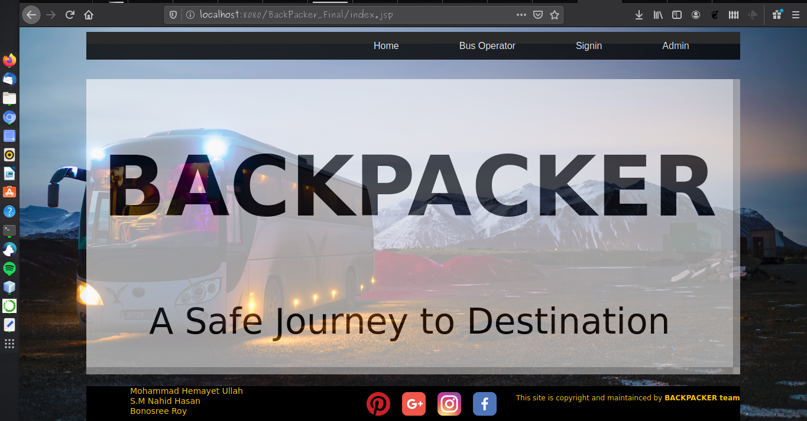

# Backpacker
An Online Bus Ticket reservation system. 

# Home Page

# Passenger Profile
A passenger must be signed up for using the service of the Backpacker. He/She can edit his profile information anytime. 

# Available Trip
This page will show the available trip based on the date and the route choosen by the passengers. 

# Seat Orientation
Seats are Oriented based on the actual position of the seats in bus. Red mark seats are already booked by someone, a passenger cant select those seat untill anyone cancell his/her trip

# Seat Selection

#Admins Panel
Admin panel have the root previlige of the websites. Admin can add or cancell any trip, he can modify the date and time if he want to do. Those screenshots will be update here very soon. 

Thank you.
